# 🥗 Open Food Nutrition Score Model
UCSD DSE 220 Project (Fall 2025)  
Team: Spencer Hoyle, Francisco Chavezosa, Sean He


## Table of Contents
1. [Introduction](#1-introduction)
2. [Figures](#2-figures)
3. [Methods](#3-methods)  
4. [Results](#4-results)
5. [Discussion](#5-discussion)
6. [Conclusion](#6-conclusion)
7. [Statement of Collaboration](#7-statement-of-collaboration)
8. [Environment Setup](#8-environment-setup)

---

## 1. Introduction
The objective of this project is to develop a supervised machine learning model for predicting the **Nutri-Score (A–E)**, a key indicator of nutritional quality, for a wide range of food products.

<br>
[Learn more about Nutri-Score](https://world.openfoodfacts.org/nutriscore)

Utilizing the comprehensive **Open Food Facts** dataset — containing detailed nutritional and ingredient information for more than four million products worldwide — this study performs data preprocessing and feature engineering by extracting attributes from three primary domains:

- Nutrient values  
- Ingredient composition  
- Additive content

These processed features are used to train classification algorithms designed to accurately assign Nutri-Scores to new or unlabeled products.

<br>
[Learn more about Open Food Facts](https://world.openfoodfacts.org/discover)


By automating the nutritional assessment process, the project seeks to:
- Demonstrate the potential of data-driven approaches in food health evaluation  
- Provide insights into the relative importance of nutritional and compositional factors that influence Nutri-Score classification  

The findings of this study aim to support consumers, manufacturers, and public health stakeholders in making more informed decisions about food quality and nutritional healthfulness.

---

## 2. Figures

This section presents selected figures used throughout our exploratory analysis and modeling workflow.


-  [Figure 1: Summary Statistics](#figure-1-summary-statistics)
 -  [Figure 2: Duplicate Records](#figure-2-duplicate-records)
 -  [Figure 3: Top 10 Category Tags](#figure-3-top-10-category-tags)
 -  [Figure 4: Top 10 Food Group Tags](#figure-4-top-10-food-group-tags)
 -  [Figure 5: Top 10 Labels Tags](#figure-5-top-10-labels-tags)
 -  [Figure 6: Top 10 Additives Tags](#figure-6-top-10-additives-tags)
 -  [Figure 7: Top 10 Allergens Tags](#figure-7-top-10-allergens-tags)
 -  [Figure 8: Nutri-score Distribution](#figure-8-nutri-score-distribution)
 -  [Figure 9: Pearson Correlation Heatmap](#figure-9-pearson-correlation-heatmap)
 -  [Figure 10: Spearman Correlation Heatmap](#figure-10-spearman-correlation-heatmap)
 -  [Figure 11: Nutrient Feature Correlation Plot](#figure-11-nutrient-feature-correlation-plot)
 -  [Figure 12: Class SMOTE Balance](#figure-12-class-smote-balance)
 -  [Figure 13: KNN Classification Report (First Model)](#figure-13-knn-classification-report-first-model)
 -  [Figure 14: KNN Confusion Matrix (First Model)](#figure-14-knn-confusion-matrix-first-model)
 -  [Figure 15: PCA Cumulative Variance (Second Model)](#figure-15-pca-cumulative-variance-second-model)
 -  [Figure 16: KMeans Tuning (Second Model)](#figure-16-kmeans-tuning-second-model)
 -  [Figure 17: KMeans Clusters (Second Model)](#figure-17-kmeans-clusters-second-model)

## 3. Methods
This section summarizes the workflow used to extract, explore, preprocess, and prepare the data for modeling. Each step references the corresponding Jupyter notebook in the repository.

### 3.1 Data Extraction  
Notebook: [1_data_extraction.ipynb](notebooks/1_data_extraction.ipynb)

We extracted the Open Food Facts dataset from Hugging Face to be used in our project.

- Downloaded raw 4M+ row Open Food Facts dataset from Hugging Face ([food.parquet](https://huggingface.co/datasets/openfoodfacts/product-database/blob/main/food.parquet))
- Inspected structure, datatypes, and memory footprint  
- Selected essential columns and filtered incomplete records  
- Parsed JSON fields into tabular form  
- Exported cleaned dataset as `food.csv`

---

### 3.2 Data Exploration  
Notebook: [2_eda.ipynb](notebooks/2_eda.ipynb)

We analyzed the dataset to understand feature distributions, identify data quality issues, and explore relationships between nutritional variables.
- Reviewed dataset structure 
- Examined nutrient distributions and summary statistics  
- Analyzed missingness and duplicate records
- Identified outliers or anomolies
- Visualized Nutri-Score distribution  
- Identified strong correlations among nutrient features

---

### 3.3 Data Preprocessing  
Notebook: [3_data_preprocessing.ipynb](notebooks/3_data_preprocessing.ipynb)  
Documentation: [Preprocessing_Deliverable.md](documentation/Preprocessing_Deliverable.md)

We prepared the data for modeling through cleaning, feature engineering, encoding, scaling, and class balancing.

- **Clean Data**: Remove duplicates, cap outliers, fix units, handle missing values
- **Feature Engineering**: Calculate ratios, extract binary flags, simplify categories
- **Encode & Scale**: RobustScaler, target encoding, one-hot encoding
- **Split Data**: Stratified 70/15/15 train/val/test split
- **Balance Classes**: Apply SMOTE to training set only

**Important**: We split BEFORE balancing to prevent synthetic samples from leaking into validation/test sets.

---

### 3.4 First Model  
Notebook: [`notebooks/4_first_model.ipynb`](notebooks/4_first_model.ipynb)

This notebook establishes our baseline predictive model using the processed dataset, exploring initial classification performance.
- Loaded processed train/val/test splits  
- K-Nearest Neighbors (KNN) classifier with k = 7
- Evaluated early performance (accuracy, precision/recall, F1)  

---

### 3.5 Second Model — KMeans clustering (method)
Notebook: [`notebooks/5_second_model.ipynb`](notebooks/5_second_model.ipynb)

This notebook implements our second model using unsupervised method.

- KMeans clustering applied after PCA dimensionality reduction.
- PCA: explored up to 30 components; used n_components=2 for visualization and final clustering.
- Tuning: subsample (50,000 rows) used to evaluate k ∈ {2,3,4,5} using WCSS (inertia) and silhouette.
- Choose the best number of clusters for KMeans.

---

## 4. Results
This section summarizes results of each method step.

### 4.1 Data Extraction - Results

- Downloaded raw Dataset saved to `food.parquet` (4m rows)
- Filtered dataset for english products with valid nutriscore, and products with ingredenients, reducing size from 4m rows to 424k rows.

``` python
# Filter out invalid or blank nutriscore grade
df = df[df["nutriscore_grade"].isin(["a", "b", "c", "d", "e"])]

# Filter out products with no ingredients
df = df[~df["ingredients"].isna()]

# Filter for English language products
df = df[df["lang"] == "en"]
```

- Parsed Tags, Ingredients, and Nutriments and selected relevant features, reducing size from 110 columns to 24 columns.

``` python
final_cols = [
    "code", "brands", "product", "lang", "categories_tags", "food_groups_tags", "labels_tags",
    "additives_n", "additives_tags", "allergens_tags",
    "ingredients_analysis_tags", "ingredients_n", "ingredients_from_palm_oil_n", "ingredients",
    "completeness", "energy", "sugars", "added_sugars", "carbohydrates", "salt", "fat",
    "trans_fat", "proteins", "nutriscore_grade"
]
```
- Initally Processed Dataset saved to `food.csv` (424k rows)

---

### 4.2 Data Exploration - Results

The dataset contains 424,297 observations and 24 features:
- `code`: Unique product code
- `brands`: Brand name of the food product
- `product`: Name of the food product
- `lang`: Language of the product
- `categories_tags`: List of category tags
- `food_groups_tags`: List of food group tags
- `labels_tags`: List of label tags
- `additives_n`: Number of additives
- `additives_tags`: List of additive tags
- `allergens_tags`: List of allergen tags
- `ingredients_ananlysis_tags`: List of ingredients analysis tags
- `ingredients_n`: Number of ingredients
- `ingredients_from_palm_oil_n`: Number of ingredients from palm oil
- `ingredients`: List of ingredients
- `completeness`: Completeness of product data (%)
- `energy`: Energy per 100g
- `sugars`: Sugar per 100g
- `added_sugar`: Added sugar per 100g
- `carbohydrates`: Carbohydrates per 100g
- `salt`: Salt per 100g
- `fat`: Fat per 100
- `trans_fat`: Trans fat per 100g
- `proteins`: Protein per 100g
- **`nutriscore_grade`**: Nutritional score grade (a,b,c,d,e)

---
#### Summary Statistics:

##### **Figure 1: Summary Statistics**
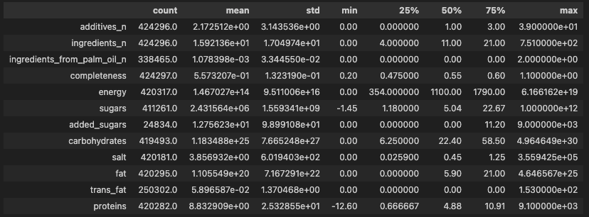  

--- 
#### Duplicates:
We identified ~25,000 duplicate brand + product combinations. These may be true duplicates or distinct product variations.

##### **Figure 2: Duplicate Records**
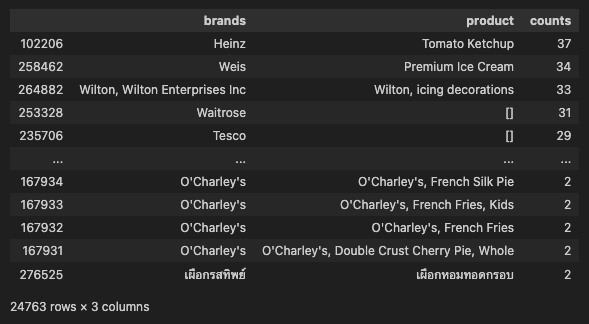

---
#### Product Tags:
We identified the most frequently used tags in our product dataset to help understand the data and identify any areas for additional feature engineering.

##### **Figure 3: Top 10 Category Tags**
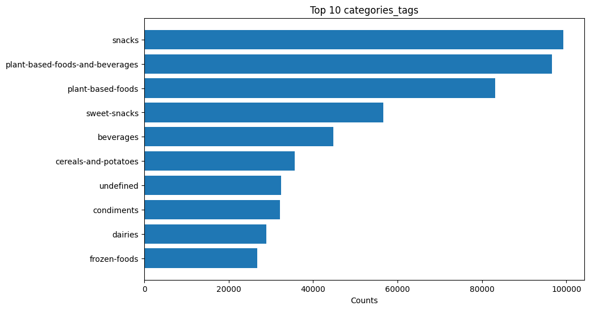

##### **Figure 4: Top 10 Food Groups Tags**
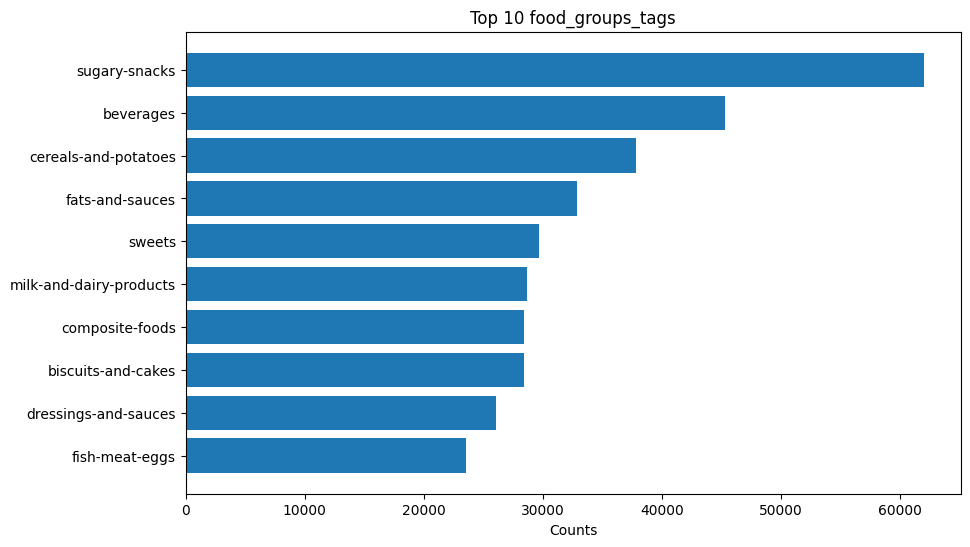

##### **Figure 5: Top 10 Labels Tags**
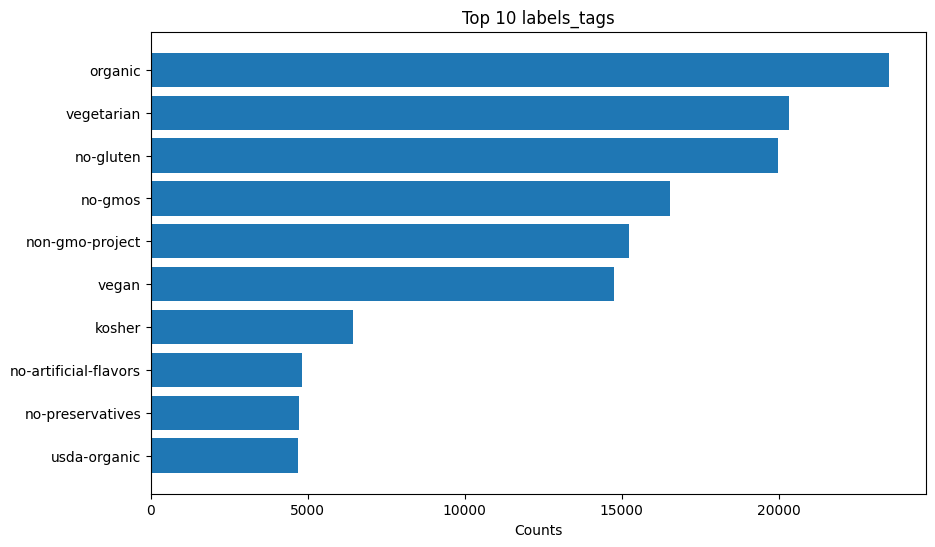

##### **Figure 6: Top 10 Additives Tags**
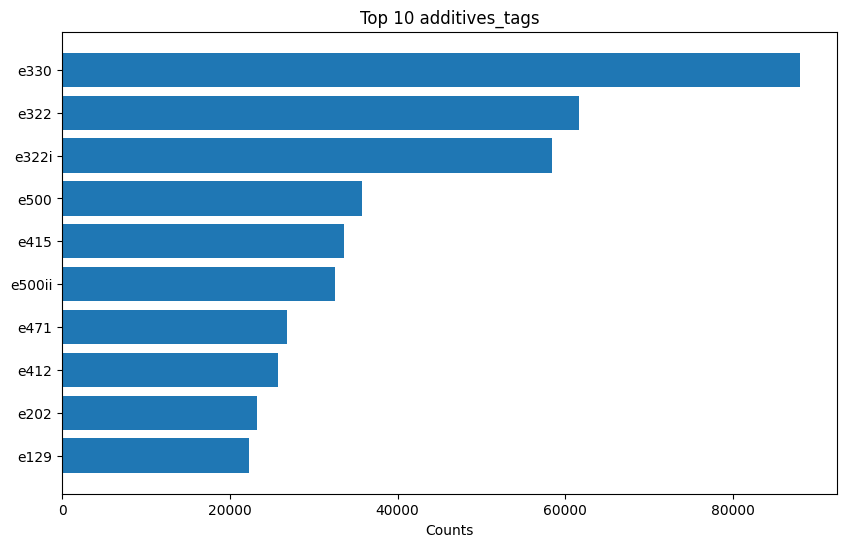

##### **Figure 7: Top 10 Allergens Tags**
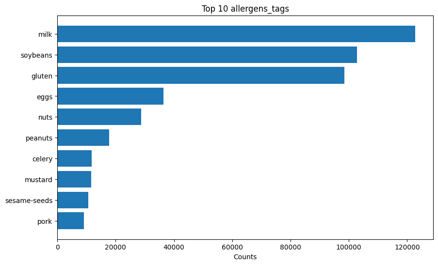

---

#### Missing Values:
- added_sugars: 94% missing
- labels_tags: 72% missing
- trans_fat: 41% missing
- brands: 28% missing
- ingredients_from_palm_oil_n: 20% missing

---

#### Outliers:
We identified some outliers with certain products having significantly large amounts of `energy`, `sugars`, `carbohydrates`, `salt`, and `fat`.

---

#### Nutri-Score:
We analyzed the proportions of nutri-scores.

##### Figure 8: Nutri-score Distribution
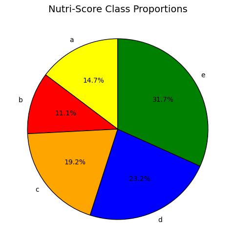

---

**Feature Correlation Results**

##### **Figure 9: Pearson Correlation Heatmap**  
Shows linear relationships between nutritional variables.  
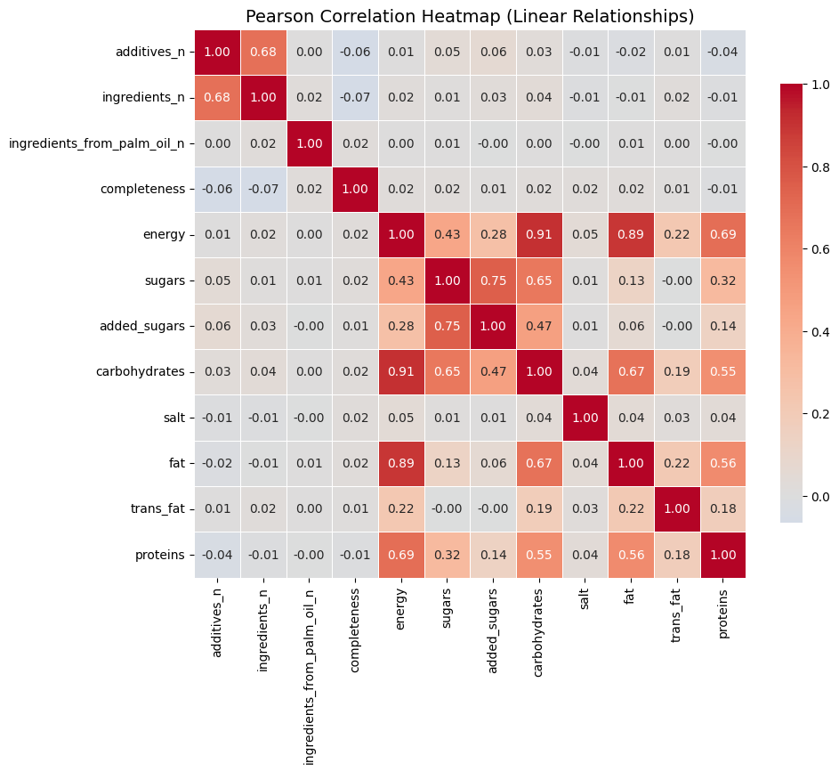

##### **Figure 10: Spearman Correlation Heatmap**  
Captures monotonic (nonlinear) relationships among nutrients.  
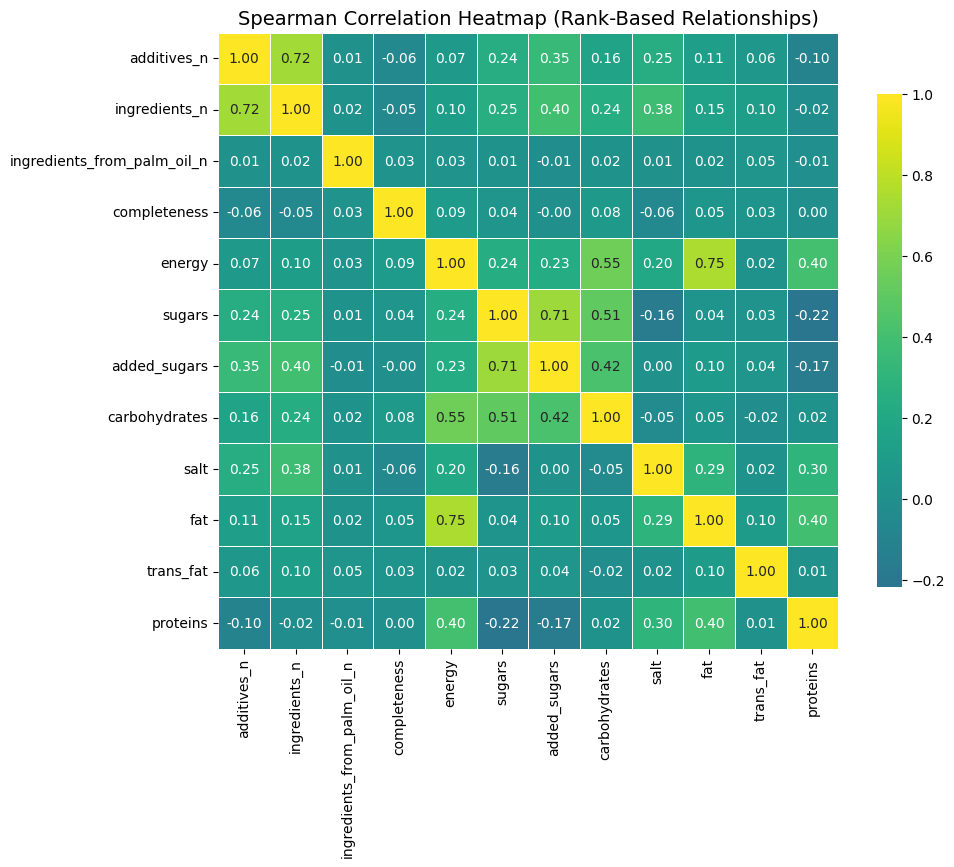

##### **Figure 11: Nutrient Feature Correlation Plot**  
Visualizes pairwise nutrient interactions and their density distributions.  
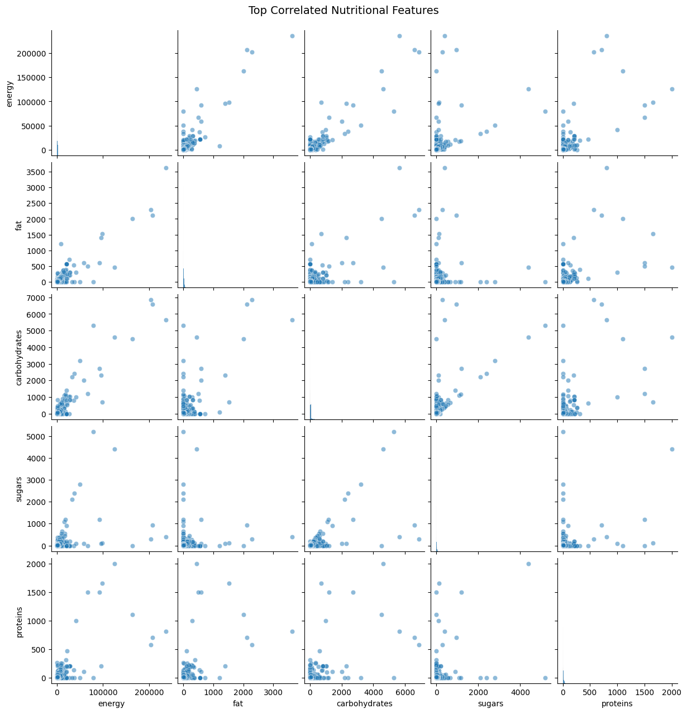


---

### 4.3 Data Preprocessing - Results

#### Phase 1: Clean the Data
- Removed duplicate brand/products and kept the record with the highested `completeness` (101,798 rows removed)
- Fixed mixed units (energy), converting kJ to kcal forv alues over 500.
- Capped outlier extrems at 99th percential for nutrient features.
- Handled missing values:
  - **added_sugars**: Drop
  - **labels_tags**: Replace null with [] (empty list)
  - **brands**: Fill with "unknown"
  - **product**: Drop
  - **ingredients_from_palm_oil_n**: Drop
  - **Main nutrients**: Fill with median
  - **ingredient_n**: Drop
- Results saved to `food_clean.csv` (346,071 rows, 22 columns)

#### Phase 2: Feature Engineering
- Calculate Nutrient Ratios
  - **sugar_carb_ratio**: sugars / carbohydrates (high = primarily sugar)
  - **fat_energy_density**: fat / energy (fat has 9 kcal/g)
  - **protein_density**: proteins / energy (higher is better)
  - **sodium_mg**: salt * 400 (convert to sodium for guidelines)
- Extract Binary Flags from Tags (`is_vegatarian`, `is_vegan`, `is_organic`, etc)
<br><br>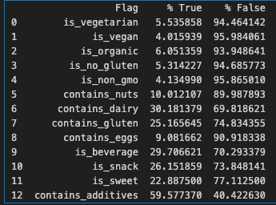<br>
- Simplify Categories, reducing 10,000 + category combinations to 8 primary tiers
  - Beverages: 103152
  - Snacks: 84670
  - Other/Undefined: 81992
  - Condiments: 26245
  - Dairy: 23719
  - Meat & Seafood: 21600
  - Grocery: 4262
  - Bakery: 431
- Processing Indicators

#### Phase 3: Encode & Scale
- Scale numeric features using RobustScaler (median and IQR)
- Encode Categorical Features
- Encode Target Varaibles (ordinal)
  - A = 0
  - B = 1
  - C = 2
  - D = 3
  - E = 4
- Split data into 70% train, 15% validation, 15% test
- SMOTE successfully balanced minority Nutri-Score classes in the training set

##### Figure 12: Class SMOTE Balance
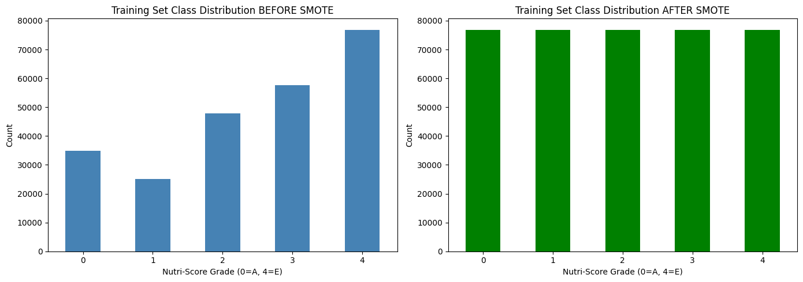

- Processed Data saved
  - `train_processed.csv`: (384,395 rows, 38 columns)
  - `val_processed.csv`: (51,911 rows, 38 columns)
  - `test_processed.csv`: (51,911 rows, 38 columns)

---

### 4.4 First Model - Results

Our first model using KNN (k=7) had the following results:
- Train Accuracy: 0.8559
- Val Accuracy: 0.7635
- Test Accuracy: 0.7648

##### Figure 13: KNN Classification Report (First Model)
<br>
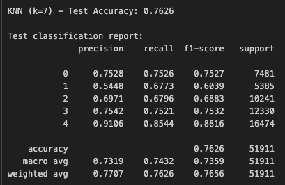

##### Figure 14: KNN Confusion Matrix (First Model)
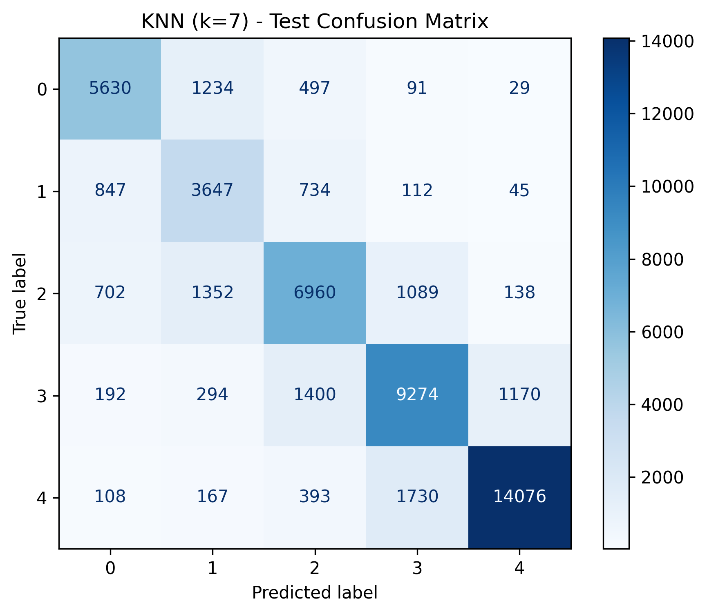


---

### 4.5 Second Model — KMeans (results)

Our second model using PCA and KMeans had the following results:

##### Figure 15: PCA Cumulative Variance (Second Model)
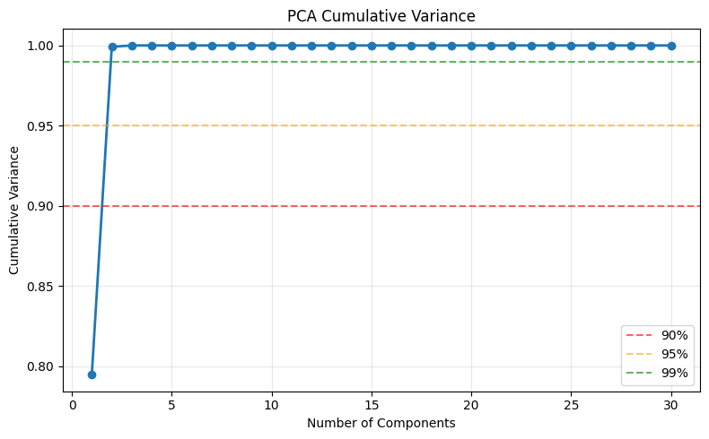

- PC1: 0.7947 (cumulative: 0.7947)
- PC2: 0.2045 (cumulative: 0.9991)
- PC3: 0.0009 (cumulative: 1.0000)
- PC4: 0.0000 (cumulative: 1.0000)
- PC5: 0.0000 (cumulative: 1.0000)
- PC6: 0.0000 (cumulative: 1.0000)
- PC7: 0.0000 (cumulative: 1.0000)
- PC8: 0.0000 (cumulative: 1.0000)
- PC9: 0.0000 (cumulative: 1.0000)
- PC10: 0.0000 (cumulative: 1.0000)

##### Figure 16: KMeans Tuning (Second Model)
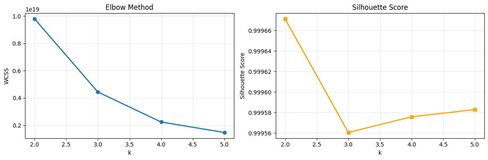

- Use k=5 to match 5 Nutri-Score grades
- WCSS: 2.60e+19
- Silhouette: 0.999578
- Cluster distribution
  - 0 (99.95%)
  - 1 (0.006%)
  - 2 (0.003%)
  - 3 (0.003%)
  - 4 (0.003%)

##### Figure 17: KMeans Clusters (Second Model)
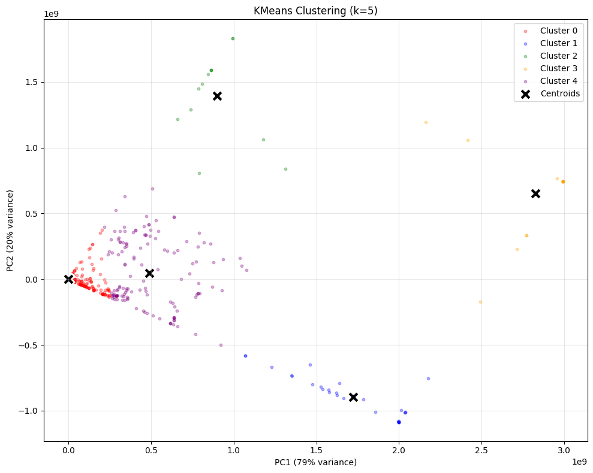

---

## 5. Discussion

This section summarizes the reasoning behind our methodological choices, interprets the results, and highlights limitations in the project.

---

### 5.1 Data Extraction - Discussion
Our extraction and filtering choices were driven by the need to create a reliable, consistent subset of the Open Food Facts dataset. Restricting the data to English-language products, valid Nutri-Score entries, and products with ingredient lists ensured that downstream models were trained on clean and usable information.

---

### 5.2 Data Exploration - Discussion
EDA revealed several challenges—highly skewed nutritional distributions, missing values in key fields, and a strong imbalance across Nutri-Score grades—which directly informed our preprocessing steps.

**Summary Statistics**:

Numeric columns (nutrients and counts) are right-skewed, with many low values and a few extreme outliers.

- `energy` values vary widely, suggesting mixed units (kcal vs kJ) — will need normalization later.
- `completeness` averages around 0.6, meaning most records are moderately detailed.

**Nutri-Score analysis**:

- The blue/green slices (d, e) dominate the dataset.
- Healthy classes a and b occupy smaller areas.
- This imbalance might affect model learning and should be taken into consideration.

**Strong Positive Correlations**:

These reflect expected nutritional relationships:
- **Energy ↔ Carbohydrates (0.91)** — Carbs are a major calorie source.  
- **Energy ↔ Fat (0.89)** — Fat contributes the most calories per gram (9 kcal).  
- **Energy ↔ Proteins (0.69)** — Protein adds calories but less than fat/carbs.  
- **Carbohydrates ↔ Sugars (0.65)** — Sugars are a subset of total carbs.  
- **Ingredients_n ↔ Additives_n (0.68–0.72)** — More complex/processed foods contain more additives.

**Moderate or Weak Correlations**:

- **Added sugars ↔ Sugars (0.71)** — Added sugars contribute significantly to total sugars.  
- **Added sugars ↔ Carbohydrates (0.42)** — High added-sugar foods trend toward high carbs.  
- **Energy ↔ Sugars (moderate)** — Sugary products contribute calories but not as strongly as fats or complex carbs.  
- **Salt ↔ Other nutrients (near 0)** — Salty and sweet foods represent distinct product categories.  

**Negative or Near-Zero Correlations**:

- **Proteins ↔ Sugars (–0.22)** — High-protein foods tend to have lower sugar content.  
- **Completeness ↔ All nutrients (≈0)** — Completeness reflects data quality, not nutrition.  
- **Trans_fat ↔ Nutrients (≈0)** — Trans fat levels relate more to regulation than general nutrition.

**Insights From Pairwise Nutrient Plots**:

- **Energy vs. Fat** shows the strongest upward trend; fat-rich foods are the most calorie-dense.  
- **Energy vs. Carbohydrates** is positive but more variable due to different product types.  
- **Energy vs. Sugars** shows moderate correlation—sugar contributes calories, but not as dominantly as fats.  
- **Energy vs. Protein** has a mild positive slope, consistent with protein’s lower caloric density.

---

### 5.3 Data Preprocessing - Discussion
The preprocessing pipeline was designed to correct inconsistencies and create a modeling-ready dataset.  
- **Outlier capping** and **unit normalization** (especially for energy) were necessary to prevent extreme values from distorting model learning.  
- **Feature engineering** clarified nutritional relationships by introducing meaningful ratios and dietary indicators.  
- **Encoding and scaling** ensured numeric stability and allowed categorical features (e.g., tags) to contribute meaningfully to prediction.  
- **SMOTE** was applied to address class imbalance, which was crucial for preventing the model from collapsing toward predicting majority classes (C, D, and E).

These decisions collectively improved the quality and structure of the inputs fed to the models.

---

### 5.4 First Model - Discussion

We trained our first supervised learning model using a K-Nearest Neighbors (KNN) classifier with k = 7, selected based on initial experimentation. The model was trained using the balanced training set (after applying SMOTE) and evaluated on both validation and test sets. Our numeric features were scaled using the RobustScaler, and missing values were imputed using median imputation, ensuring the model received clean and normalized inputs.

The training performance shows a high accuracy of 0.8559, indicating that KNN can effectively learn patterns from the training data. However, the validation and test accuracies drop to 0.7635 and 0.7648, respectively. This ~9% accuracy gap suggests mild overfitting: the model performs well on the balanced training data but struggles slightly when generalizing to unseen samples with the original class distribution.

From the classification reports, performance varies by class. Nutri-Score grades A (0) and E (4) achieve high recall and F1-scores, while grade B (1) remains more difficult to classify due to its overlap with adjacent nutritional profiles. Across all metrics, the validation and test reports are closely aligned, indicating stable generalization. The confusion matrix further shows that most misclassifications occur between adjacent Nutri-Score categories, which is expected given the ordinal nature of the target.

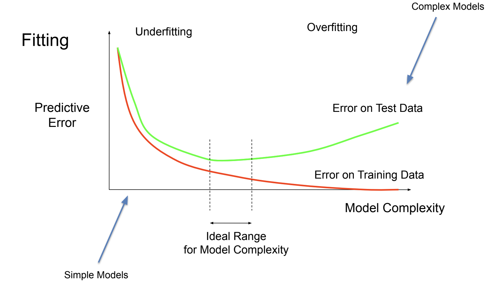

The model sits between overfit and appropriately fit, which is normal for KNN.

In summary, KNN model shows moderate overfitting, with training accuracy at 85.6% and validation/test accuracy around 76.4%. The stable match between validation and test accuracy suggests good generalization, despite expected overfitting inherent to KNN.

To understand where our KNN model lies on the underfitting-overfitting curve, we trained several models using different values of k (the number of neighbors). As expected, changing k significantly affected the balance between model complexity and generalization. When we used small k values such as 3 or 5, the model achieved extremely high training accuracy—over 87% and up to 91%. However, the validation accuracy showed no improvement and remained around 76%. This pattern indicates clear overfitting: the model memorized the training data, forming an overly complex decision boundary that does not generalize well to new samples.

On the other end of the spectrum, when we increased k to larger values like 9 or 11, the training accuracy declined noticeably, and validation accuracy also slightly decreased. This behavior suggests underfitting, as the model becomes too simple and smooths out important distinctions across Nutri-Score classes. Both training and validation performance drop, meaning the model can no longer capture the underlying structure of the nutritional data.

Among all tested configurations, k = 7 achieved the best overall performance. It maintains relatively high training accuracy (about 86%) while achieving the strongest validation accuracy (~76.35%). This balance places the model in a zone of mild overfitting, which is expected for KNN—especially due to the large, SMOTE-balanced training dataset. The small generalization gap between the validation and test accuracy (both ~76.4%) confirms that the model generalizes consistently and that there is no data leakage or instability in preprocessing.

Given these findings, the KNN model with k = 7 sits slightly toward the overfitting side of the fitting graph but still performs reliably.

For future improvements, we plan to explore models that naturally combat variance and capture nonlinear patterns more effectively. Decision Trees and Random Forests are strong next candidates because they can model feature interactions and typically generalize better on tabular datasets like this. Support Vector Machines (SVM) may also be beneficial due to their ability to learn complex boundaries with kernel methods, while Naive Bayes can provide a fast baseline comparison. These models could help reduce overfitting and improve classification accuracy beyond the performance ceiling of KNN.

1. Decision Trees can capture nonlinear interactions between nutritional features; provide interpretability (feature importance), and often outperform KNN on tabular data

2. Random Forest reduces variance compared to a single tree; provides stronger generalization, and handles high-dimensional feature sets well, and less sensitive to feature scaling

3. Support Vector Machines (SVM) is effective for multiclass classification; works well with standardized numeric features; and good at finding nonlinear boundaries with kernels

4. Naive Bayes is very fast baseline, handles categorical + numeric data well; useful for comparison with more complex models.


---

### 5.5 Second Model — Discussion

Before running KMeans, we apply PCA to reduce dimensions and understand feature redundancy (37 Feautures). It also improves KMeans performance by reducing dimensionality and removing correlated features.

The results are striking - our 37 features collapse to essentially 2 dimensions:
- **PC1**: 79.5% of variance
- **PC2**: 20.4% of variance  
- **Total**: 99.9% with just 2 components
- **Remaining 35 components**: <0.1% variance

This extreme collapse reveals heavy feature redundancy from preprocessing:

1. **RobustScaler** normalized everything to similar scales, creating linear relationships
2. **One-hot encoding** created math dependent features (8 categories = 8 dependent binary columns)
3. **Target encoding** compressed thousands of brands into one numeric value
4. **Binary features** correlate with nutrition (e.g, is_vegan to low protein)
5. **Feature engineering** created perfect correlations (e.g., sodium_mg = salt * 40)

PC1 most likely represents the main **nutrition density** axis (healthy to unhealthy), while PC2 captures secondary variation (maybe beverage vs solid and / or protein vs carbs).

We'll use 2 components since that captures 99.9% of variance. The extreme reduction (37D to 2D) suggests the data may lack natural diversity for meaningful clustering.

**Interpreting Tuning Results**:
- **WCSS**: Measures cluster tightness (lower = better). Always decreases as k increases.
- **Silhouette Score**: Measures cluster separation quality, range -1 to +1 (higher = better)

Our results show very high silhouette scores (~0.9996) across all k values, which initially looks great. However, this can be misleading when combined with severe cluster imbalance.

When you have one massive cluster (99%+ of samples) and tiny outlier clusters, silhouette can be artificially high because the outliers are well-separated from the main mass, but this doesn't mean we found meaningful groups.

We chose **k=5** to align with the 5 Nutri-Score grades, letting us compare unsupervised clusters to the supervised categories.

- **Cluster 0 basically ate the whole dataset**
- **99.96%** of all products -> dense red cluster
- The other 4 clusters are tiny
  - Black Xs = cluster centers
  - PC1 (79%) = main nutrition gradient
  - PC2 (20%) = smaller differences (like drinks vs solids)

Everything collapsed into one giant group, so KMeans can't find real structure.

Our preprocessing made the data **too uniform**, which works for KNN but **breaks unsupervised clustering**.


This model exhibits **underfitting**:

**Evidence**:
- Cluster purity of 22.5% shows poor performance even on training data
- No meaningful pattern discovered -- 99.96% in one cluster
- Cannot distinguish between nutritional quality categories

**Root cause**: Not model complexity but **data preprocessing destroyed natural variation**:
- RobustScaler normalized away variance that separates product types
- Feature engineering created perfect correlations (sodium_mg = salt * 40)
- One-hot encoding added dependent features
- 37D collapsed to 2D (99.9% variance) indicating artificial homogeneity

This **is not** traditional underfitting from model simplicity, but rather **data inadequacy** for unsupervised task(s).

---

### 5.6 Model Comparison - Discussion

#### What Went Wrong? - Key Insights

The preprocessing pipeline was inadvertantly **optimized for supervised learning** (KNN: 76.5% accuracy) but **conflicts with unsupervised learning**, especially for our application of KMeans:

**For KNN (supervised)**: Our preprocessing works great!
- RobustScaler makes distances comparable
- SMOTE balances classes
- Feature engineering creates predictive correlations
- Result: 76.5% test accuracy (potentially higher leveraging other features)

**For KMeans (unsupervised)**: Same preprocessing fails!
- RobustScaler destroys natural variance clusters need
- SMOTE adds synthetic samples reducing diversity
- Feature engineering creates artificial correlations
- Result: 99.96% in one cluster and 22.5% purity

**The main culprit** -- Aggressive normalization and feature correlation.

#### Model Improvements

1. **Different preprocessing**: StandardScaler instead of Robust, keep 5-10 PCA components or cluster on raw features (a completley different approach to our current method)
2. **Skip SMOTE**: Use natural distribution (though testing and results showed this wasn't the main issue in this case, but is still problematic)
3. **Alternative algorithms**: DBSCAN finds density-based clusters and Hierarchical shows dendrogram
4. **Simpler features**: Use only 9 base nutritional features and skip engineered ratios

#### Final Takeaway

Model 2 demonstrates a valid PCA + KMeans implementation with correct metrics (0.9996 silhouette). However, the severe cluster imbalance (99.96% in one cluster, 22.5% purity) reveals a harsh lesson:

**Preprocessing optimized for supervised learning can destroy the natural variation that unsupervised clustering needs.**

The same preprocessing that gives KNN 76.5% accuracy makes KMeans fail at finding groups. For future work:
- **For supervised learning**: Current preprocessing works great
- **For clustering**: Need different preprocessing that preserves natural variance

This was not a failure of KMeans -- it is a **valuable learning experience** about matching preprocessing strategies to model objectives.

---

### 5.7 Future Models
A natural next step for this work would be to explore more advanced modeling approaches that can capture nonlinear relationships and richer feature interactions. Ensemble methods such as Random Forests, Gradient Boosting, XGBoost, or LightGBM are strong candidates because they offer robustness to noisy nutritional data and excel at modeling complex patterns across mixed feature types. Deep neural networks also present an appealing direction, particularly when combined with additional modalities such as ingredient text or product images. Incorporating transformer-based NLP models could extract semantic information from ingredient lists, while vision models such as CNNs or Vision Transformers could use product images to provide complementary signals that are not present in the structured features. For applications where interpretability is essential, simpler models paired with explainability techniques may also be valuable. Finally, for unsupervised analysis, representation learning approaches such as autoencoders or clustering on minimally processed data which could reveal intrinsic structure without the distortions introduced by aggressive preprocessing. Collectively, these models offer meaningful opportunities to improve performance, interpretability, and multimodal integration in future iterations of this project.

---

## 6. Conclusion
This project provided valuable insights into the complexities of preparing and modeling real-world nutritional data. One of the most significant lessons learned is the extent to which preprocessing choices influence downstream model behavior. Approaches that enhanced supervised learning performance—such as scaling methods, engineered nutrient ratios, and resampling strategies like SMOTE—were shown to introduce distortions that impeded the effectiveness of unsupervised analyses. In retrospect, a clearer separation between supervised and unsupervised pipelines, along with more deliberate consideration of each method’s underlying assumptions, would have strengthened the overall study design.

Given additional time, several extensions would be worthwhile. These include integrating natural language processing techniques to analyze unstructured ingredient text, incorporating product images to capture visual nutritional cues, and experimenting with more sophisticated models or ensembles to further improve predictive accuracy. Reducing preprocessing intensity for unsupervised tasks and exploring clustering directly on raw or minimally processed data would also provide a more faithful representation of inherent structure in the dataset.

Overall, this work underscores both the promise and the challenges of applying machine learning to nutritional assessment. While the results indicate that Nutri-Score can be predicted effectively from structured features, achieving robust and interpretable insights requires careful alignment between data transformation strategies and the methodological objectives of each analytical stage.

---

## 7. Statement of Collaboration

**Spencer Hoyle – Team Lead**  
Led project deadlines and milestones, project structure, dataset extraction and final report writing.

**Sean He – Machine Learning Engineer**  
Performed exploratory data analysis, contributed to modeling and evaluation (primarily model #1).

**Francisco Chavezosa – Machine Learning Engineer**  
Performed data preprocessing, contributed to modeling and evaluation (primarily model #2).

---

## 8. Environment Setup

1. Clone the repository
```bash
git clone https://github.com/swhoyle/food-nutrition-model.git
cd open-food-nutrition-score
```

2. Install dependencies ([requirements.txt](requirements.txt))
```
pip install -r requirements.txt
```

3. Open and run the notebooks in the `notebooks/` folder

- [1_data_extraction.ipynb](notebooks/1_data_extraction.ipynb): Download and extract dataset (`food.parquet` → `food.csv`)  
- [2_eda.ipynb](notebooks/2_eda.ipynb): Exploratory data analysis
- [3_data_preprocessing.ipynb](notebooks/3_data_preprocessing.ipynb): Data cleaning and preprocessing
- [4_first_model.ipynb](notebooks/4_first_model.ipynb): Build our first prediction model
- [5_second_model.ipynb](notebooks/5_second_model.ipynb): Build our second prediction model